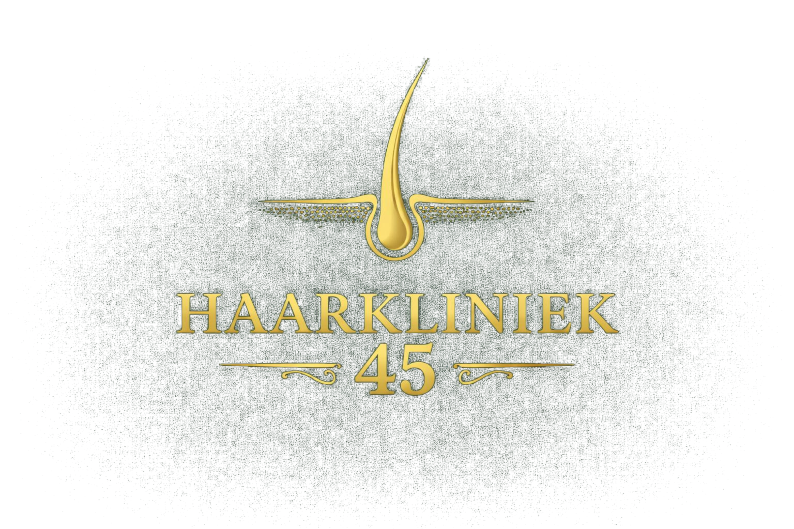

Please update the following from a ux-dev / senior ux designer / engineer using playwright mcp.
Please explore each issue with playwright before implementing (both on hairclinicwolf.be where needed and the new application.)

- Please remove the top-bar, its not very usefull
- THe transparent background of the following images are more green then transparent, cna you recreate each 'logo' with a transparent background (not green): , , 
- We do not have any reviews yet, please remove every reference to reviews and review stars. You can decide to hide it for now.
- I've asked you to recreat hairclinicwolf.be's pages in this website, i am missing a lot of pages available in hairclinicwolfs webiste accessible via their menu. Why did you not cover this , please do so. Also plase revisit the ones you have completed and make sure css styles are applied (some have no valid css styling.)
